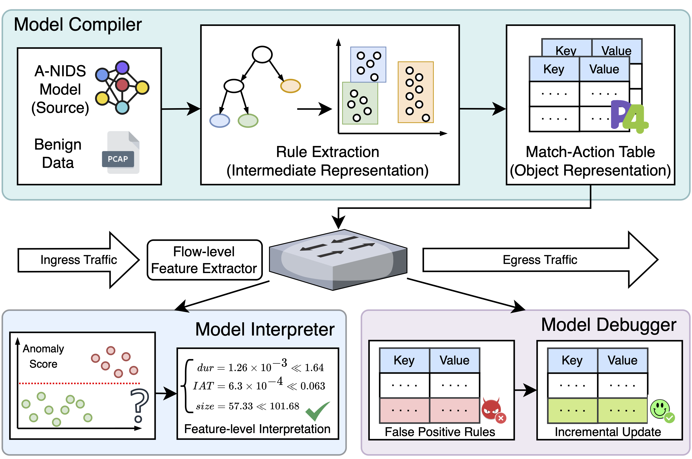

# Genos: General In-Network Unsupervised Intrusion Detection by Rule Extraction

This is the project site of our paper "Genos: General In-Network Unsupervised Intrusion Detection by Rule Extraction" (accepted by INFOCOM '24). The code is primarily developed by Ruoyu Li and Yu Zhang.

* Jan. 12th, 2024: We are still making our effort to clean up the source code, and will upload it ASAP once finished.

### Abstract

Anomaly-based network intrusion detection systems (A-NIDS) use unsupervised models to detect unforeseen attacks.
However, existing A-NIDS solutions suffer from low throughput, lack of interpretability, and high maintenance costs. Recent in-network intelligence (INI) exploits programmable switches to offer line-rate deployment of NIDS. Nevertheless, current in-network NIDS are either model-specific or only apply to supervised models.
In this paper, we propose Genos, a general in-network framework for unsupervised A-NIDS by rule extraction, which consists of a Model Compiler, a Model Interpreter, and a Model Debugger.
Specifically, observing benign data are multimodal and usually located in multiple subspaces in the feature space, we utilize a divide-and-conquer approach for model-agnostic rule extraction. In the Model Compiler, we first propose a tree-based clustering algorithm to partition the feature space into subspaces, then design a decision boundary estimation mechanism to approximate the source model in each subspace. The Model Interpreter interprets predictions by important attributes to aid network operators in understanding the predictions. The Model Debugger conducts incremental updating to rectify errors by only fine-tuning rules on affected subspaces, thus reducing maintenance costs.
We implement a prototype using physical hardware, and experiments demonstrate its superior performance of 100 Gbps throughput, great interpretability, and trivial updating overhead.




### Citation

If our work assists you, we would appreciate it if you acknowledge it in your citations：
```bash
@inproceedings{li2024genos,
  title={Genos: General In-Network Unsupervised Intrusion Detection by Rule Extraction},
  author={Li, Ruoyu and Li, Qing and Zhang, Yu and Zhao, Dan and Xiao, Xi and Jiang, Yong},
  booktitle={IEEE INFOCOM 2024 - IEEE Conference on Computer Communications},
  year={2024}
}
```
